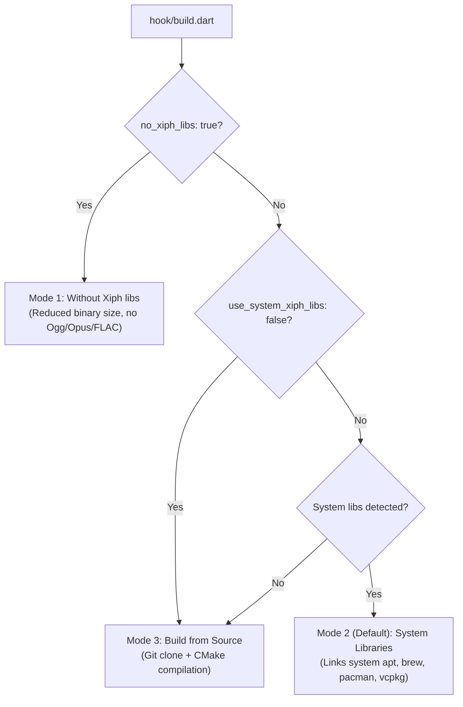

## Overview

*flutter_soloud* supports audio streaming and real-time playback for compressed audio formats including **Ogg**, **Vorbis**, **Opus**, and **FLAC** via libraries from [Xiph.org](https://www.xiph.org/).

Starting in version 5.1+, *flutter_soloud* uses **Dart Native Assets build hooks** to provide flexible options for handling Xiph libraries:



1. **Default Mode (Auto-Detect System Libraries)**: Automatically detects system-installed Xiph libraries (via `pkg-config` or standard OS paths). If found, it links against them for fastest build times. If not found (or on mobile platforms), it automatically falls back to cloning and compiling them from source.
2. **Force Source Build (`use_system_xiph_libs: false`)**: Forces compiling Xiph libraries from source via Git and CMake, bypassing system library detection entirely.
3. **Without Xiph Mode (`no_xiph_libs: true`)**: Skips Xiph libraries entirely to reduce application binary size when streaming/Ogg formats are not required.

---

## 1. Default Mode: Automatic Detection

No configuration is required in your `pubspec.yaml`!

When you build your Flutter application (`flutter run`, `flutter build`, `flutter test`), Dart's native build hook will automatically:
1. **Check for system packages**: Uses `pkg-config` and standard system paths to see if `ogg`, `vorbis`, `opus`, and `flac` are already installed on your system. If present, it links against them immediately.
2. **Fallback to source compilation**: If system libraries are not found (or when targeting mobile platforms like Android or iOS), it automatically clones the Xiph Git repositories (`ogg`, `vorbis`, `opus`, `flac`) pinned to known-good commits into `.dart_tool/flutter_soloud/xiph/sources/`, builds them with CMake into `.dart_tool/flutter_soloud/xiph/install/<os>/<arch>`, and caches them for future runs.

### Requirements
- **Git** installed on your system PATH (`git --version`).
- **CMake** installed on your system PATH (`cmake --version`).
- A C/C++ compiler (e.g. `gcc`/`clang` on Linux, Xcode on macOS, MSVC on Windows).

If you do not have Git or CMake, or prefer not to build from source, use either the **System Libraries** or **Without Xiph** options below.

---

## 2. Using System-Installed Libraries (`use_system_xiph_libs`)

If you prefer to use system-wide native libraries (or want to speed up clean builds), you can install them using your operating system's package manager and tell *flutter_soloud* to link against them.

### Step 1: Install System Packages

<Tabs>
  <Tab title="Ubuntu / Debian / Raspberry Pi OS">
  ```bash
  sudo apt update
  sudo apt install libogg-dev libvorbis-dev libopus-dev libflac-dev pkg-config
  ```
  </Tab>
  <Tab title="Arch Linux / Manjaro">
  ```bash
  sudo pacman -S libogg libvorbis opus flac pkgconf
  ```
  </Tab>
  <Tab title="Fedora / RHEL">
  ```bash
  sudo dnf install libogg-devel libvorbis-devel opus-devel flac-devel pkgconf-pkg-config
  ```
  </Tab>
  <Tab title="macOS (Homebrew)">
  ```bash
  brew install libogg libvorbis opus flac pkg-config
  ```
  </Tab>
  <Tab title="Windows (vcpkg)">
  ```powershell
  vcpkg install libogg:x64-windows libvorbis:x64-windows opus:x64-windows flac:x64-windows
  ```
  Set the `VCPKG_ROOT` environment variable if not already set (e.g., `C:\vcpkg`).
  </Tab>
</Tabs>

### Downloading Prebuilt Binaries for Windows

If you are on Windows and prefer to download prebuilt binaries manually rather than compiling from source or installing via `vcpkg`:

1. **Download the Binaries**:
   - **FLAC**: [FLAC Download Page](https://xiph.org/flac/download.html) and [FLAC Official GitHub Releases](https://github.com/xiph/flac/releases) (grab the `flac-*-win.zip` release package)
   - **Ogg**: [Xiph Ogg Downloads](https://xiph.org/downloads/) and [Ogg Official GitHub Releases](https://github.com/xiph/ogg/releases)
   - **Vorbis**: [Xiph Vorbis Downloads](https://xiph.org/downloads/) and [Vorbis Official GitHub Releases](https://github.com/xiph/vorbis/releases)
   - **Opus**: [Opus Codec Downloads](https://opus-codec.org/downloads/) and [Opus Official GitHub Releases](https://github.com/xiph/opus/releases)
   - **Repository Prebuilt Binaries**: You can also download the precompiled `.dll` and `.lib` files bundled in the [flutter_soloud GitHub repository](https://github.com/alnitak/flutter_soloud/tree/main/windows/libs).

2. **Where to Place the Files**:
   When `use_system_xiph_libs: true` is configured on Windows, the build hook searches the following locations for `.lib` files and header includes:
   - `%VCPKG_ROOT%\installed\<arch>-windows\lib`
   - `C:\vcpkg\installed\<arch>-windows\lib`
   - `C:\tools\vcpkg\installed\<arch>-windows\lib`
   - `C:\Program Files\Xiph\lib` and `C:\Program Files\Xiph\include`
   - `C:\Xiph\lib` and `C:\Xiph\include`
   - Custom paths defined in your environment's `LIB` and `INCLUDE` variables

   Place the `.lib` files (e.g. `ogg.lib`, `opus.lib`, `vorbis.lib`, `FLAC.lib`) in one of the `lib` paths above, and header folders (`ogg/`, `opus/`, `vorbis/`, `FLAC/`) in the corresponding `include` directory.
   Ensure the matching `.dll` files are in your system `PATH` or next to your compiled application executable.

### Step 2: Enable in `pubspec.yaml`

Add `use_system_xiph_libs: true` under `hooks.user_defines.flutter_soloud` in your root app's `pubspec.yaml`:

```yaml
hooks:
  user_defines:
    flutter_soloud:
      use_system_xiph_libs: true
```

The build hook will use `pkg-config` (and standard platform include/library paths) to link against the installed system libraries.

---

## 3. Forcing Source Compilation (`use_system_xiph_libs: false`)

If you want to ensure Xiph libraries are always built from source using the pinned git repositories (bypassing any system-installed libraries), set `use_system_xiph_libs: false`:

```yaml
hooks:
  user_defines:
    flutter_soloud:
      use_system_xiph_libs: false
```

When active, *flutter_soloud* skips system library detection and compiles the exact pinned versions of `ogg`, `vorbis`, `opus`, and `flac` into `.dart_tool/flutter_soloud/xiph/install/`.

---

## 4. Building Without Xiph Libraries (`no_xiph_libs`)

If your app only plays uncompressed PCM / WAV audio or built-in synthesizer waveforms and you want to reduce your app's binary size by **600 KB to 3 MB**:

Add `no_xiph_libs: true` to your `pubspec.yaml`:

```yaml
hooks:
  user_defines:
    flutter_soloud:
      no_xiph_libs: true
```

When built without Xiph:
- The compiler defines `NO_XIPH_LIBS`.
- No Xiph libraries are downloaded, compiled, or linked.
- Audio streaming with Opus/Vorbis/FLAC formats is disabled (an exception is thrown if attempted).
- All standard WAV, MP3, and synthesis features remain 100% operational.

See [Without Xiph libs](/get_started/no_xiph_libs) for full details.
