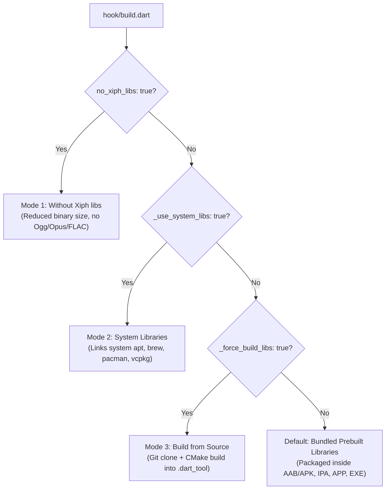

## Overview

*flutter_soloud* supports audio streaming and real-time playback for compressed audio formats including **Ogg**, **Vorbis**, **Opus**, and **FLAC** via libraries from [Xiph.org](https://www.xiph.org/).

Starting in version 5.1+, *flutter_soloud* uses **Dart Native Assets build hooks** to provide flexible options for handling Xiph libraries across all platforms:



1. **Default Mode (Bundled Prebuilt Libraries)**: No configuration is required. *flutter_soloud* automatically links and packages tested, precompiled Xiph binaries from `xiph/prebuild/<platform>/`. This guarantees that packaged apps (Android AAB/APK, iOS IPA, macOS .app, Windows .exe) run out of the box with zero external dependencies and zero setup.
2. **System Libraries Mode (`<platform>_use_system_libs: true`)**: Links against system-installed packages (apt, pacman, dnf, Homebrew, vcpkg). Ideal for Linux distribution packages (`.deb`, `.rpm`, Arch AUR).
3. **Build from Source Mode (`<platform>_force_build_libs: true`)**: Clones the pinned Xiph Git repositories (`ogg`, `vorbis`, `opus`, `flac`) and builds them locally using CMake into `.dart_tool/flutter_soloud/xiph/install/<os>/<arch>`.
4. **Without Xiph Mode (`no_xiph_libs: true`)**: Skips Xiph libraries entirely across all platforms to reduce application binary size.

---

## 1. Default Mode: Bundled Prebuilt Libraries

**No configuration is needed in your `pubspec.yaml`!**

By default, the Dart build hook automatically links and bundles precompiled libraries from `xiph/prebuild/`:
- **Android**: Bundles prebuilt shared `.so` files for all 4 architectures (`arm64-v8a`, `armeabi-v7a`, `x86`, `x86_64`) into your APK or AAB bundle under `lib/<abi>/`.
- **iOS**: Links static `.a` archives directly into the plugin binary for both device and simulator.
- **macOS**: Links static `.a` archives directly into `libflutter_soloud.dylib`. This ensures the `.app` or `.dmg` is self-contained and never crashes on user machines that lack Homebrew.
- **Windows**: Bundles precompiled `.dll` files next to the compiled executable.
- **Linux**: Bundles precompiled `.so` files alongside the application.

---

## 2. Using System-Installed Libraries (`<platform>_use_system_libs`)

On desktop platforms, you can instruct *flutter_soloud* to link against libraries installed in the operating system.

<Warning>
If you package an application with system libraries, the end user running your application **must** have those libraries installed on their machine. If missing, the app will fail to load the native library on startup (with an actionable error message indicating how to install them).
</Warning>

### Step 1: Install System Packages

Install the Xiph development packages using your platform's package manager:

#### Ubuntu / Debian / Raspberry Pi OS
```bash
sudo apt update
sudo apt install libogg-dev libvorbis-dev libopus-dev libflac-dev pkg-config
```

#### Arch Linux / Manjaro
```bash
sudo pacman -S libogg libvorbis opus flac pkgconf
```

#### Fedora / RHEL
```bash
sudo dnf install libogg-devel libvorbis-devel opus-devel flac-devel pkgconf-pkg-config
```

#### macOS (Homebrew)
```bash
brew install libogg libvorbis opus flac pkg-config
```

#### Windows (vcpkg)
```powershell
vcpkg install libogg:x64-windows libvorbis:x64-windows opus:x64-windows flac:x64-windows
```
Set the `VCPKG_ROOT` environment variable if not already set (e.g., `C:\vcpkg`).

### Downloading Prebuilt Binaries for Windows

If you are on Windows and prefer to download prebuilt binaries manually:

1. **Download the Binaries**:
   - **FLAC**: [FLAC Download Page](https://xiph.org/flac/download.html) and [FLAC Official GitHub Releases](https://github.com/xiph/flac/releases)
   - **Ogg**: [Xiph Ogg Downloads](https://xiph.org/downloads/) and [Ogg Official GitHub Releases](https://github.com/xiph/ogg/releases)
   - **Vorbis**: [Xiph Vorbis Downloads](https://xiph.org/downloads/) and [Vorbis Official GitHub Releases](https://github.com/xiph/vorbis/releases)
   - **Opus**: [Opus Codec Downloads](https://opus-codec.org/downloads/) and [Opus Official GitHub Releases](https://github.com/xiph/opus/releases)

2. **Where to Place the Files**:
   When `windows_use_system_libs: true` is configured, the build hook searches:
   - `%VCPKG_ROOT%\installed\<arch>-windows\lib`
   - `C:\vcpkg\installed\<arch>-windows\lib`
   - `C:\Program Files\Xiph\lib` and `C:\Program Files\Xiph\include`
   - `C:\Xiph\lib` and `C:\Xiph\include`

### Step 2: Enable in `pubspec.yaml`

Add the platform-specific flag under `hooks.user_defines.flutter_soloud` in your app's `pubspec.yaml`:

```yaml
hooks:
  user_defines:
    flutter_soloud:
      linux_use_system_libs: true
      # or macos_use_system_libs: true
      # or windows_use_system_libs: true
```

---

## 3. Forcing Source Compilation (`<platform>_force_build_libs`)

If you want to compile the Xiph libraries from the official pinned Git repositories using CMake on your own machine:

```yaml
hooks:
  user_defines:
    flutter_soloud:
      linux_force_build_libs: true
      # or macos_force_build_libs: true
      # or windows_force_build_libs: true
      # or android_force_build_libs: true
      # or ios_force_build_libs: true
```

<Warning>
**Build time impact:** Setting `<platform>_force_build_libs: true` significantly increases build times. The build hook will `git clone` all four Xiph repositories (`ogg`, `vorbis`, `opus`, `flac`) and compile them from source via CMake.

Keep in mind that:
- **Android** compiles across 4 architectures (`arm64-v8a`, `armeabi-v7a`, `x86`, `x86_64`).
- **Apple (iOS / macOS)** compiles for both device and simulator architectures.
- Compilation artifacts are cached in `.dart_tool/`, meaning a full re-clone and re-compile will occur after every `flutter clean` or on clean CI/CD runs.

For everyday development, leaving this option at its default (`false`) to use the bundled precompiled libraries is strongly recommended.
</Warning>

### Requirements
- **Git** installed on your system PATH (`git --version`).
- **CMake** installed on your system PATH (`cmake --version`).
- A C/C++ compiler (GCC/Clang on Linux, Xcode on macOS/iOS, MSVC on Windows, Android NDK for Android).

Artifacts are compiled into `.dart_tool/flutter_soloud/xiph/install/<os>/<arch>` and cached for future builds.

---

## 4. Building Without Xiph Libraries (`no_xiph_libs`)

If your app only plays uncompressed PCM / WAV audio or built-in synthesizer waveforms and you want to reduce your app's binary size by **600 KB to 3 MB**:

Add `no_xiph_libs: true` to your `pubspec.yaml`:

```yaml
hooks:
  user_defines:
    flutter_soloud:
      no_xiph_libs: true
```

When built without Xiph:
- The compiler defines `NO_XIPH_LIBS`.
- No Xiph libraries are linked or bundled.
- Compressed audio streaming with Opus/Vorbis/FLAC formats is disabled (`SoLoudXiphLibsNotAvailableException` is thrown if attempted).
- All standard WAV, MP3, and synthesis features remain 100% operational.

See [Without Xiph libs](/get_started/no_xiph_libs) for full details.
